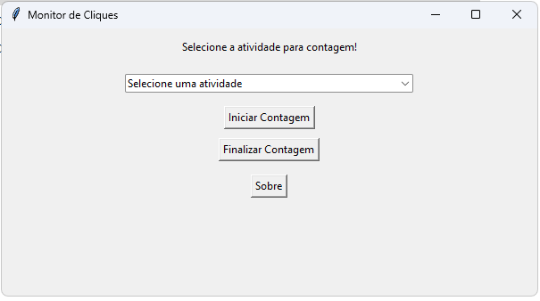
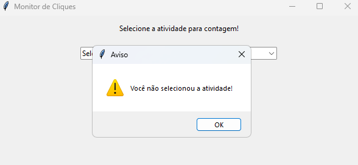
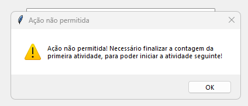
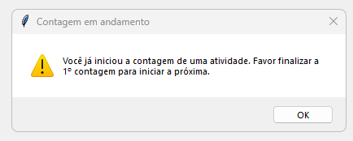
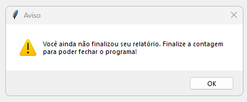

# Monitoramento_De_Cliques_Atividades
# Monitor de Cliques

## Descrição

O **Monitor de Cliques** é uma aplicação desenvolvida em Python utilizando **Tkinter**, **Pandas** e **OpenPyXL** para monitorar e registrar eventos de cliques do mouse. A aplicação captura informações como coordenadas do clique, horário, janela ativa e atividade selecionada, armazenando os dados em uma planilha Excel para análise posterior.

## Funcionalidades
- Interface gráfica intuitiva com **Tkinter**.
- Registro automático dos cliques do mouse.
- Armazenamento dos dados em planilhas **Excel**.
- Geração de relatórios consolidando o tempo gasto em cada atividade.
- Monitoramento de bloqueio de tela, interrompendo automaticamente a contagem quando detectado.

## Tecnologias Utilizadas
- **Python 3**
- **Tkinter** (Interface gráfica)
- **Pandas** (Manipulação de dados)
- **OpenPyXL** (Manipulação de arquivos Excel)
- **Pynput** (Monitoramento de eventos do mouse)
- **Pywinauto** (Automatização de interfaces do Windows)
- **Win32 API** (Interação com a API do Windows)
- **Threading** (Execução de tarefas em segundo plano)

## Interface do Monitor de Cliques



A interface do Monitor de Cliques apresenta um design simples e funcional, focado na usabilidade e eficiência. Aqui estão os principais elementos e suas funções:

# Elementos da Interface
1. Título da Janela:
- "Monitor de Cliques" é exibido na barra superior, deixando claro o propósito do aplicativo.

2. Mensagem de Orientação:
- O texto "Selecione a atividade para contagem!" instrui o usuário sobre a ação inicial necessária.

3. ComboBox (Dropdown Menu):
- Permite que o usuário selecione a atividade desejada para a contagem dos cliques.
- Exibe um placeholder "Selecione uma atividade", incentivando a interação.

4. Botões de Controle:
- Iniciar Contagem: Começa o monitoramento dos cliques do usuário.
- Finalizar Contagem: Interrompe o monitoramento e gera um relatório com os dados coletados.
- Sobre: Exibe informações sobre o aplicativo e seu desenvolvimento.

## Orientações de usabilidade

O Monitor de Cliques inclui diversas mensagens de erro e aviso para garantir que o usuário siga o fluxo correto de uso. Aqui estão os principais casos em que essas mensagens aparecem:

# 🚨 1. Tentativa de iniciar sem selecionar uma atividade
- Mensagem:

- Quando ocorre:
O usuário clica em "Iniciar Contagem" sem escolher uma atividade no ComboBox.
- Propósito da mensagem:
Evitar que cliques sejam registrados sem uma categorização adequada.

# 🚨 2. Tentativa de trocar de atividade durante a contagem
- Mensagem:

- Quando ocorre:
O usuário tenta mudar a atividade selecionada enquanto a contagem está ativa.
- Propósito da mensagem:
Garantir que os registros de cliques sejam atribuídos corretamente a uma única atividade por vez.

# 🚨 3. Tentativa de iniciar uma nova contagem sem finalizar a anterior
- Mensagem:

- Quando ocorre:
- O usuário tenta iniciar uma nova contagem sem ter finalizado a anterior.
- Propósito da mensagem :
Evitar sobreposição de registros e possíveis inconsistências no relatório.

# 🚨 4. Tentativa de salvar quando o arquivo Excel está aberto
- Mensagem:
"O arquivo já está aberto! Feche-o antes de salvar."
- Quando ocorre:
O usuário tenta finalizar a contagem ou gerar o relatório enquanto o arquivo Excel está em uso.
- Propósito da mensage,:
Prevenir falhas ao gravar os dados na planilha, pois arquivos abertos podem impedir modificações.

OBS: Caso o Excel seja aberto no Excel online, esta mensagem não irá aparecer. Só irá aparecer se utilizar o Software Desktop. 

# 🚨 5. Tentativa de fechar o programa sem finalizar a contagem
- Mensagem:

- Quando ocorre:
O usuário tenta fechar a aplicação enquanto a contagem ainda está ativa.
- Propósito da manegsam:
Evitar que a sessão seja encerrada sem que os dados sejam salvos corretamente.

## Monitoramento de Bloqueio de Tela

O sistema conta com uma funcionalidade avançada para detectar o bloqueio de tela do Windows. Se o usuário bloquear a tela enquanto a contagem de cliques estiver ativa, a aplicação automaticamente:

1. Registra o evento na planilha como "Bloqueio de Tela".
2. Interrompe a contagem para evitar registros incorretos.
3. Exibe um alerta, informando ao usuário que a contagem foi finalizada devido ao bloqueio de tela.

Essa funcionalidade garante que o tempo de atividade seja registrado corretamente, prevenindo inconsistências caso o usuário saia do computador temporariamente.

## Como Executar o Projeto
### 1. Instalar Dependências
Antes de executar a aplicação, instale as dependências necessárias com o seguinte comando:
```bash
pip install tkinter pandas openpyxl pynput pywinauto pywin32
```

### 2. Executar a Aplicação
Execute o arquivo Python principal:
```bash
python monitor_cliques.py
```

## Como Utilizar
1. Selecione a atividade desejada no menu suspenso.
2. Clique no botão **"Iniciar Contagem"**.
3. Utilize o mouse normalmente; cada clique será registrado.
4. Para interromper a contagem e salvar os dados, clique em **"Finalizar Contagem"**.
5. O sistema gera um relatório automático consolidando o tempo gasto em cada atividade.
6. Caso a tela seja bloqueada, o programa finaliza automaticamente a contagem e registra o evento.

## Estrutura do Arquivo Excel
A planilha gerada contém as seguintes colunas:
- **X**: Coordenada X do clique.
- **Y**: Coordenada Y do clique.
- **Data**: Data do clique.
- **Hora**: Hora exata do clique.
- **Contagem Segundos**: Tempo desde o último clique registrado.
- **Tipo de Navegação**: Se o clique ocorreu em um aplicativo ou navegador.
- **Nome da Janela**: Nome da janela onde o clique ocorreu.
- **Nome do Clique**: Controle específico clicado dentro da janela.
- **Atividade**: Atividade selecionada pelo usuário.

## Autor
Desenvolvido por **Pamella Barros e Robson Calheira**


